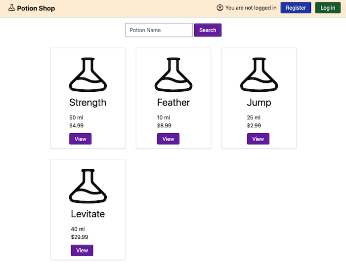

# Potion Shop

Potion Shop is an intentionally vulnerable Elixir/Phoenix application, for teaching developers about web application security. This project is vulnerable to common vulnerabilities such as XSS, CSRF, and RCE. 



**Warning** - Do not deploy this application in your production environment. Attackers can exploit Potion Shop to gain access to the underlying server, then use this access to further compromise your network. 


## Setup 

This guide assumes you have Erlang and Elixir running locally. See [Installing Elixir and Erlang With ASDF](https://www.pluralsight.com/guides/installing-elixir-erlang-with-asdf) if you need help with this step.

```
Elixir "~> 1.13"
Phoenix "~> 1.5.15"

* Install dependencies with `mix deps.get`
* Create and migrate your database with `mix ecto.setup`
* Start Phoenix endpoint with `mix phx.server` or inside IEx with `iex -S mix phx.server`
```

## Getting Started

If you are experienced with Elixir, Phoenix, and web security, see the [self_guided.md](./docs/self_guided.md) document. It assumes the reader is familiar with vulnerabilities such as XSS, CSRF, and RCE. The methodology for finding these issues is not covered as well. 

For a walkthrough of the Potion Shop application, and guidance on how to find security problems, see [tutorial.md](./docs/tutorial.md). This document provides an introduction to web application security, Elixir security tools, and exposition on the risk of each vulnerability. 

For a description of where each vulnerability is located, see [answers.md](./docs/answers.md). It is highly recommended to avoid reading the answers when using Potion Shop for your own education. Use this document to check your own understanding, after reading [tutorial.md](./docs/tutorial.md) and putting in effort to uncover each security issue. 

## Authors

Michael Lubas ([Paraxial.io](https://paraxial.io/)) - https://www.linkedin.com/in/michaellubas/

Jonathan Kilby - https://www.linkedin.com/in/jonathankilby1991/

## Project Sponsors

<a href="https://erlef.org/"></a>

Potion Shop is funded through the generous support of the Erlang Ecosystem Foundation. 


<a href="https://paraxial.io/"></a>

Potion Shop is sponsored by [Paraxial.io](https://paraxial.io/), an application security platform for Elixir and Phoenix. 